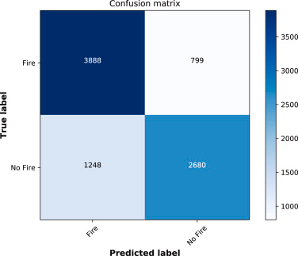

# parallel-cross-ppi

目前实现：

- cross-ppi均值区间估计（MPI并行）Bcast
- cross-ppi分位数区间估计（MPI并行）Bcast
- 数据集生成，扩充
- 其他并行方式，如Reduce、Scatter、Gather等

还想做：

- 记录运行时间
- 做期中汇报ppt
- 探究运行时间为何没显著减少。Reduce（加不加Bcast）和Allreduce
- cross-ppi本身的优化。再造数据集，重新划分。

## 环境

- 操作系统：Linux Ubuntu (推荐最新的 LTS 版本)
- 编译器：gcc、g++、gfortran
- 构建工具：CMake

在源码编译之前，确保系统中已经安装了 `gcc`、`g++`、`cmake` 和 `gfortran`。检查方法如下：

```bash
gcc --version
g++ --version
cmake --version
gfortran --version
```

安装`boost`库：
```bash
sudo apt-get update
sudo apt-get install libboost-all-dev
```
验证安装是否成功：
```bash
dpkg -s libboost-all-dev | grep "Status"
```

安装`mpi`:
```bash
sudo apt-get update
sudo apt-get install mpich
```
验证安装是否成功：
```bash
mpiexec --version
```

## 运行

```bash
./analysis.sh
```

## 数据集、模型、标签生成

采用[FLAME DATASET](https://www.sciencedirect.com/science/article/pii/S1389128621001201#fig3)。
- 原训练集含有39375张图片，共25018标签为“1”（着火）， 14357标签为“0”（未着火）。
- 原测试集含有8617张图片，共5137标签为“1”（着火）， 3480标签为“0”（未着火）。
- 论文的baseline模型的混淆矩阵如下：


由于cross-ppi是model-free的，我们只需要根据这个结果去**生成标签**，然后做推断即可。为了满足“**有标签数据**<<**无标签数据**”的假定，我们把混淆矩阵的原结果和预测结果作为“有标签数据Y”和“有标签数据的预测结果Y_hat”。而模型“在无标签数据的预测结果Y_hat_unlabeled”，我们根据原论文$76.23\%$的准确率去模拟生成。
```
Y: 有标签数据。共有5137个“1”和3480个“0”。
Y_hat: 有标签数据的预测结果。参见混淆矩阵。
n: Y和Y_hat的长度。n = 8617。
Y_hat_unlabeled: 无标签数据的预测结果。根据原论文$76.23\%$的准确率生成。
N: 无标签数据。N = 39375。
```